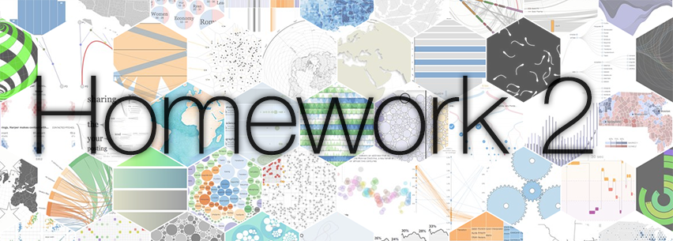
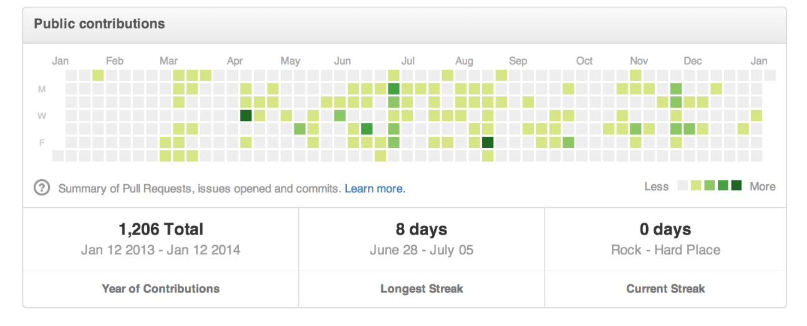
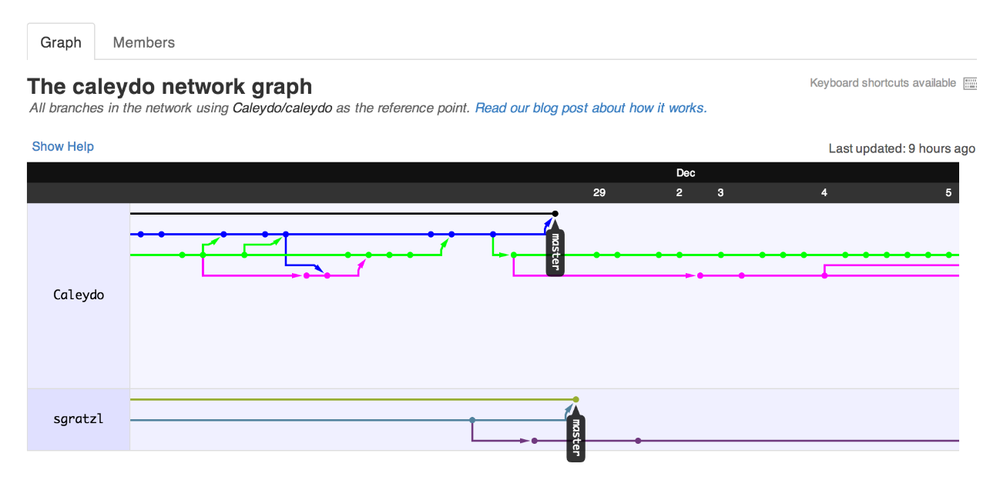
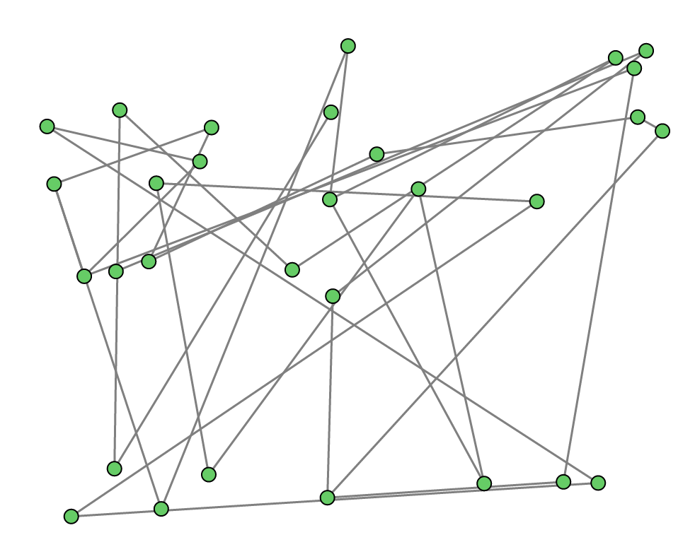
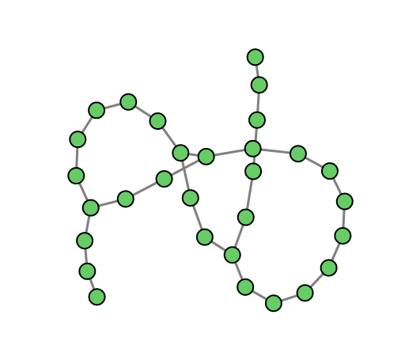
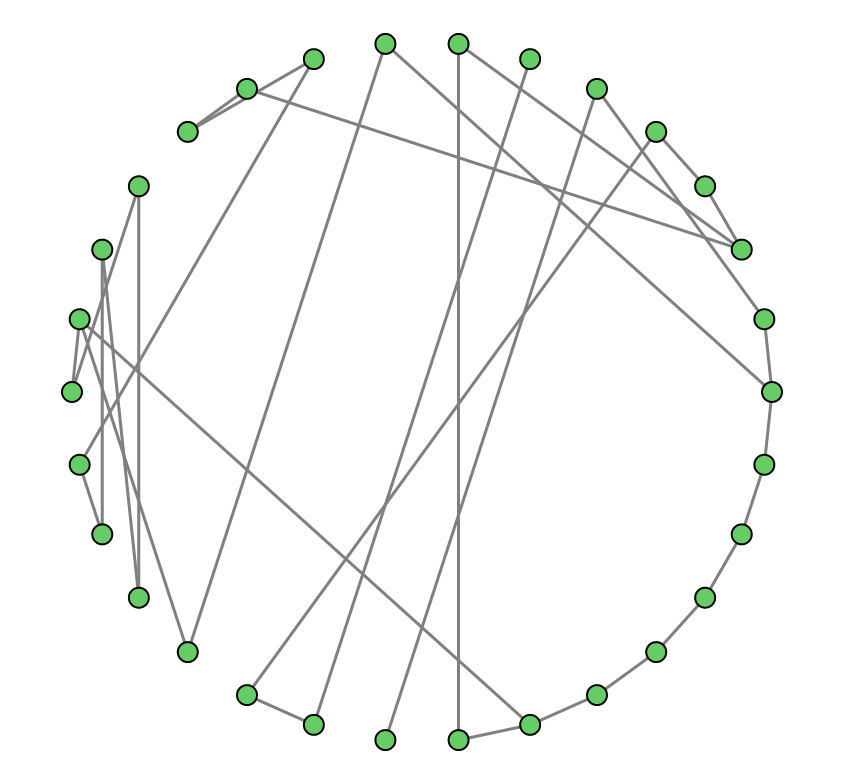
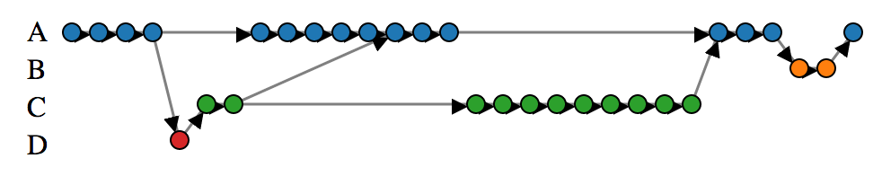
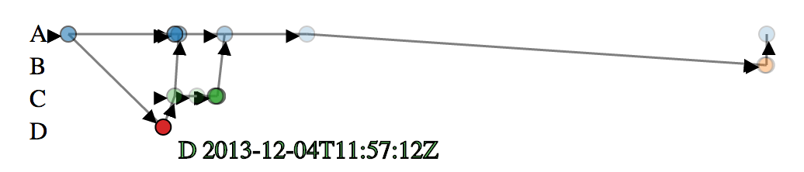
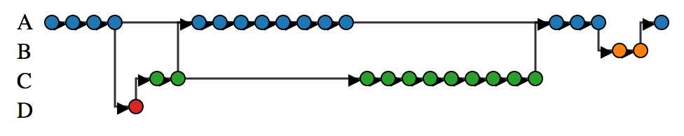

In this homework, we will dive deeper into using both Git and [GitHub](http://github.com/), the web-based service built on top of Git. We will be exploring graphs to better understand project activity and will iteratively produce node-link layouts of GitHub data.

Similar to [Homework 1](https://github.com/CS171/HW1/) we won't start with building the actual visualization right away. Instead, we are going to build up some background knowledge, which will be useful for the final visualization.

### Before Getting Started

*Design Studio* - We recommend you start by reading the entirety of the homework. Problem 3 is a design problem and will be addressed during the design studio the week following the release of this homework. However, you can start sketching before and use those sketches for this homework, and of course for the design studio.

*Homework 1 Feedback* - Please fill out the feedback [form](
https://docs.google.com/forms/d/1JEv80HLauBCspeWzsYOoBcgWsGACuuIgee7am7Sf588/viewform) for homework 1.
We would like to hear what you found engaging and measure the difficulty — your feedback allows us to balance tasks better.

### Warm up questions

* Refresh your GitHub skills by looking at [Lab 1](https://github.com/CS171/lab1/).
* If you're not familiar, review [graph data structures](http://en.wikipedia.org/wiki/Graph_(abstract_data_type)) and its various [design variations](http://reference.wolfram.com/mathematica/guide/GraphsAndNetworks.html) as well as the lecture held on Feb. 14.
* Read the D3 chapters from [Scott Murray's book](http://chimera.labs.oreilly.com/books/1230000000345/index.html).

## Problem 1: Understanding GitHub Data 
*Answer the questions in a file [problem_1_answers.md](problem_1_answers.md).*

As you may already know, GitHub tracks two types of data: the underlying Git revision data, such as forks or commits, and GitHub-specific "social" data, such as users avatars, favorite projects, and following/followers, among others. 

GitHub provides two ways to access both revision and social data:

* The GitHub website, containing accessible information for use by humans. 
* The GitHub API with raw data, for structured access by machines through programming languages.

Note that not *all* social data are shared by GitHub, mostly for privacy reasons.

### GitHub API

To access its raw data, GitHub provides a public [Application Programming Interface (API)](http://en.wikipedia.org/wiki/Application_programming_interface). An API is a common interface for web sites (or software frameworks and libraries) to allow and control limited access to its database. It is usually well-documented (see the [GitHub API](http://developer.github.com/v3/)) and it is possible to use the API to query the database directly in a browser, just by supplying the correct URL. Here is an example of using the GitHub API to [query the Django repository](https://api.github.com/repos/django/django).

A program can query the API in two ways: 

* By first downloading the data from the API, and then using it offline (changes on the servers won't be reflected in the downloaded data from that moment on). 
* By calling the API every time the programs runs (the data will be up-to-date at each API call).

In both cases, you'll need to find the URL that corresponds to your query using the [GitHub API](http://developer.github.com/v3/).

For instance, you can **download data** from GitHub by using the [curl](http://en.wikipedia.org/wiki/CURL) command line tool using the syntax shown below. In case of a security error, use the `-k` parameter or use another way to download a file from the page (e.g., use your browser).

```
curl https://api.github.com/repos/django/django -o repos_django.json
```
Your should see output similar to the following (partial) example. The output given is in JSON, a common and convenient file format that works well with D3. To understand JSON formatting, read the [JSON documentation](http://www.json.org/).

```json
{
  "id": 4164482,
  "name": "django",
  "full_name": "django/django",
  "owner": {
    "login": "django",
    "id": 27804,
    "avatar_url": "https://gravatar.com/avatar/fd542381031aa84dca86628ece84fc07",
    "gravatar_id": "fd542381031aa84dca86628ece84fc07",
    "url": "https://api.github.com/users/django",
```

To learn more about the GitHub API, read the related [Github API documentation](http://developer.github.com/guides/getting-started/). 
 
As an alternative to downloading data, you can **load the URL from the GitHub API.** GitHub allows [Cross Origin Resource Sharing](http://developer.github.com/v3/#cross-origin-resource-sharing), which means you can directly call the API from JavaScript as follows:

```javascript
    d3.json("https://api.github.com/search/repositories?q=visualization+language:javascript&sort=stars&order=desc", function(data) {
    })
```

This should produce the same output as shown above.

**Warning**: GitHub enforces a [request limit](http://developer.github.com/v3/#rate-limiting) of 60 unauthenticated requests per hour. If you are consistently hitting that limit, you can raise it to 5000 by [authenticating](http://developer.github.com/v3/oauth/). The rate limit should not pose a problem, but it is your responsibility to ensure you don't get locked out hours before the assignment is due.


### Website

Start by picking a GitHub repository you know. You should pick a medium-sized public repository, maybe one you have made contributions to. You can take a look at the [Caleydo](https://github.com/Caleydo) repository as an example. You should *not* pick a large, popular repository (we'll be looking at those in Problem 3).

The GitHub website provides a user-friendly way to look at the data. On GitHub, each user has a profile page ([example](https://github.com/alexsb)). Carefully explore this page and its interactive features. As you may have noticed, the page features a central calendar map showing the user's activity. Below is a capture of such a visualization:



Open a GitHub profile and use your browser's developer tools to locate the `div` with the `id` of `contributions-calendar`. Its first child `div` has a `data-url` attribute, which points to the raw data used by the visualization. It is a univariate time series and below is a sample of the data:

> [["2013/02/03",0],["2013/02/04",0],["2013/02/05",0],["2013/02/06",0],["2013/02/07",0],["2013/02/08",0],["2013/02/09",0],["2013/02/10",0]
 
Take a look at [other visualizations](https://github.com/mbostock/d3/graphs) from GitHub's website:

* [Contributors](https://github.com/mbostock/d3/graphs/contributors) to a repository
* [Commits Activity](https://github.com/mbostock/d3/graphs/commit-activity)
* [Code Frequency](https://github.com/mbostock/d3/graphs/code-frequency)
* [Punch card](https://github.com/mbostock/d3/graphs/punch-card)
* [Pulse](https://github.com/mbostock/d3/pulse) of a repository

#### Questions

For each of the 5 visualizations listed above plus the calendar map, answer the following questions:

* Who is the audience? (e.g. project manager, contributor, project user, visitor, etc.)
* What data have been used? How can you get the data using the [GitHub API](http://developer.github.com/v3/)? (Note that it can be the combination of multiple queries and their processing).
* Those visualizations are updated over time. What happens if suddenly a contributor pushes many commits in a short time interval? How would you address this particular issue?
  
### GitHub Network Graph

GitHub's website features a visualization called the GitHub Network Graph Visualizer ([example](https://github.com/Caleydo/caleydo/network)). It aims to visualize the often complex interactions within the repositories, showing the relationships between individual commits and branches. The graph construction is a [bit complex](https://github.com/blog/39-say-hello-to-the-network-graph-visualizer), but can be simplified as follows:

1. Each node is a commit, connected to its successor, using an arrow link.
2. Commits are spatially grouped by users, and colored by branch.
3. Links connecting the nodes try to prevent crossing as best as they can.

Here is a screen capture of the Network Graph Visualizer:



#### Questions

Looking at the network graph, answer the same questions as above, plus:

* What is the role of interaction for this visualization? Would a static graph have been sufficient?
* What happens if many new developers suddenly join the project and push commits for the first time? How would you preserve the graph's readability in such a situation?

## Problem 2: Graph Visualization
*Use the file [simple_graph.html](simple_graph.html) as a template for your code. Your resulting code after completing the problems should be put in a new file called simple_graph_answer.html*

We are now going to use the GitHub API to create a graph data structure of commit data and produce a similar visualization to the Network Graph Visualizer.

### Graph Layouts and Visual Encoding

We provided you with several *basic* graph visualization functions in the file [simple_graph.html](simple_graph.html). One of them is a basic force directed layout, generated from a graph constructed with random nodes and link connections. Such a layout is essentially a physics simulation, and node position is determined by iteratively trying to satisfy specified parameters (e.g., gravity, friction, etc.). See [some examples](https://github.com/mbostock/d3/wiki/Force-Layout).

<table>
<tr>
	<td></td>
	<td></td>
	<td></td>
</tr>
</table>

We provided other layout and visual encoding functions (see [this gist](http://bl.ocks.org/romsson/8969480)):

* Layouts: 
  * Random (each point has a random position in a bounded area)
  * Self-organized using a [force-directed](https://github.com/mbostock/d3/wiki/Force-Layout) layout
  * Radial from a [pie layout](https://github.com/mbostock/d3/wiki/Pie-Layout), sorted by category
  * Linear (projection of nodes on an axis)
* Retinal variables
  * Filling color of the nodes
  * Size of the nodes

### Re-Creation of the Network Graph Visualizer

Let's re-construct the GitHub Network Graph Visualizer using [simple_graph.html](simple_graph.html) as follows:

0. Choose any repository, as long as it meets the following  three conditions: (1) it contains commits from at least two users and has at least two branches, (2) it contains at least 30 commits from different users and branches, and (3) it is public. Because querying the API may result in partial data (e.g., not all commits are visible) it is perfectly fine if there are missing nodes and connections. In general, the diversity of the commits is more important than the quantity. For this problem you may only use a subset of all the commits, between 30 and 100 commits (but you can select more if you want).

1. Use `d3.json` to fetch commit data ([example](https://api.github.com/repos/caleydo/caleydo/commits), see [documentation](http://developer.github.com/v3/repos/commits/)) to use as input dataset to the graph. You can [find all the branches](https://api.github.com/repos/mbostock/d3/branches) of a repository, or you can directly [query the commits by branch](https://api.github.com/repos/mbostock/d3/commits?per_page=100&sha=adopt) using the URL, as demonstrated in the linked examples. If you experience delays or calls limits download the commits and use them as an offline JSON file. You may have to call the API serveral times, so you will have to make sure that you create the visualization only when all the data has been retrieved. [Here is a discussion on how to do that](https://groups.google.com/forum/#!msg/d3-js/3Y9VHkOOdCM/YnmOPopWUxQJ). For problem 2 you do not need to include forks, but you may use them if you want to.

2. Populate the provided graph data structure (`{nodes:[], links:[]}`) with commit data. Each node represents a commit with a unique id, each link points to the `parents` which is an attribute of the commit. Note there may not be parents or there can be multiple (e.g., if the commit is a merge of multiple branches). Add all metadata of a commit to the node. Be careful: some attributes are keywords reserved for the layout function (e.g., `x` and `y`) and you can't use them as variable names for metadata.

3. The GitHub Network Graph Visualizer layout is a linear layout. Extend the provided linear layout with two scales to display commits on the axis. The first scale should be index-based and use equal intervals between nodes. The second scale should use [time scales](https://github.com/mbostock/d3/wiki/Time-Scales), where the position reflects absolute time. Add a radio button and labels to switch from one to another.

4. Add SVG markers to show the link direction ([example](http://bl.ocks.org/d3noob/5155181)) and add labels for branches.

5. Color the nodes by branch or user (your choice), and when hovering over nodes, emphasize the current branch and show some details about the node itself (e.g., a tooltip with the node characteristics).

6. Vertically align your nodes either driven by user, or by branch (your choice). Ideally, you should choose color for one and position for the other of the two variables user or branch.    

7. As you may have noticed, links connecting commits are not straight lines in the GitHub network graph. Because SVG `<line>` elements are not a flexible way to draw curves, switch to using [`<path>`](http://www.w3.org/TR/SVG/paths.html) elements. You'll be able to add [control points](http://en.wikipedia.org/wiki/Control_point_(mathematics)) to shape the curve as you wish and choose the right [interpolation function](https://github.com/mbostock/d3/wiki/SVG-Shapes#wiki-line_interpolate). Here is an example of use of control points:

```javascript
var line = d3.svg.line()
  .x(function(d) { return d.x; })
  .y(function(d) { return d.y; });

...

line([
  {x: d.source.x, y: d.source.y}, 
  {x: d.source.x, y: d.source.y+offset_y}, 
  {x: d.target.x, y: d.target.y+offset_y}, 
  {x: d.target.x, y: d.target.y}
])
```

The following three screenshots show the results you may expect.

*Regular index-based interval:*



*Time scale with hovered node (note: the mouse  pointer is not visible, but hovers the unique node for user D):*



*Control points to improve links readability:*



Naturally, you are free to change the aesthetics and use alternative node color, links and text styling.

## Problem 3: Design Critique and Sketching
*Answer the questions in a file [problem_3_answers.md](problem_3_answers.md), and include your sketch as a PDF file problem_3_sketch.pdf*


### Questions

Given your previous design critiques, your experience with the previous graph visualization implementation and the reading of the article cited below (Lee et al., 2006), answer the following questions:

1. Which graph-related tasks does an ideal GitHub Network Graph need to  address?

2. Get back to the GitHub network visualization you implemented and test it with the following projects on GitHub: [D3](https://api.github.com/repos/mbostock/d3/commits?per_page=100), [jQuery](https://api.github.com/repos/jquery/jquery/commits?per_page=100) and [Bootstrap](https://api.github.com/repos/twbs/bootstrap/commits?per_page=100). There's a lot more data, but the interaction patterns of users are also very different. What do you notice about the three repositories?

3. How does this impact your graph?

4. How would you improve your visualization to address issues with the larger and more complex data?

> Lee, B., Plaisant, C., Parr, C. S., Fekete, J. D., & Henry, N. (2006, May). Task taxonomy for graph visualization. In Proceedings of the 2006 AVI workshop on Beyond time and errors: novel evaluation methods for information visualization (pp. 1-5). ACM. ([PDF](http://research.microsoft.com/en-us/um/people/nath/docs/lee_beliv06.pdf))

### Sketch an alternative to the GitHub Network Graph Visualizer

Drawing on your observations from graphing different types of GitHub networks in the previous part, and from the reading, sketch an alternate design for the GitHub Network graph. Your work should rely on the same source data (i.e. commit history), but be creative — the focus of your visualization is up to you. You are, for example, welcome to aggregate nodes or use additional GitHub data.

Attach to this homework a picture/scan of your sketch, as well as a paragraph explaining the design decisions you made and how it addresses the limits of the GitHub Network Graph Visualizer you previously identified.

## Problem 4: Sketch Implementation
*Answer the questions in a file [problem_4_answers.md](problem_4_answers.md) and provide your implementation in [problem_4.html](problem_4.html). You may include external JavaScript or stylesheets.*

You will now implement the sketch you've previously designed. Even though the sketching may have been as a group, you have to implement it yourself.

To get the full credits for this problem you need to address the following:

- Implement the sketch as an interactive visualization with D3.
- You are not expected to provide an exhaustive collection of features. Instead, focus on a few carefully designed features. We expect something roughly comparable in complexity to these [two](http://bost.ocks.org/mike/uberdata/) [examples](http://bost.ocks.org/mike/hive/).
- Note that you are free to use [D3 layouts](https://github.com/mbostock/d3/wiki/Layouts). You are also free to use any D3 example from the [gallery](https://github.com/mbostock/d3/wiki/Gallery) as a starting point, but you should significantly improve the example.
- Briefly explain your technical choices. Your final visualization may differ significantly from you original sketch or only implement a subset of it, but ensure you document the tradeoffs you faced and the reasoning behind your choices.

Also, you may have to change the graph data structure to a network depending on your implementation:

```json
{
 "name": "parent",
 "children": [
  {
   "name": "sub-parent",
   "children": [
    {
```
## Bonus

You will be credited 0.5 bonus points for exceptionally original or novel graph designs and for thorough and clear code.
